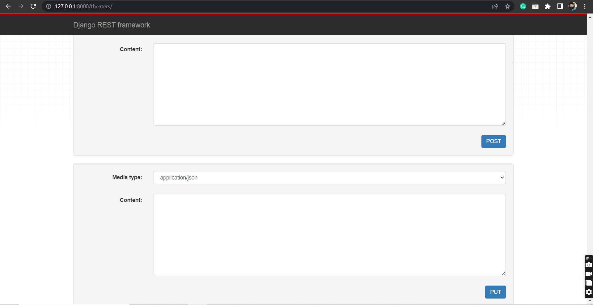

# Class-Based Ticket-booking Operation REST API in Python Django

* This repository contains a Class-Based CRUD (Create, Read) operation REST API implemented using Python and Django.

# Requirements
 * To run this application, you need the following:
   * Python 3.11.3
   * Django 4.2.1
   * Django REST Framework
  
# Get All Resources
   * URL: /localhost:8000/
   * Method: GET
   * Description: Retrieve a list of all resources.
   * Response: JSON array containing all resources.

# Create a New Resource
   * URL: /localhost:8000/
   * Method: POST
   * Description: Create a new resource.
   * Request: JSON object containing the resource data.
   * Response: JSON object representing the newly created resource.

